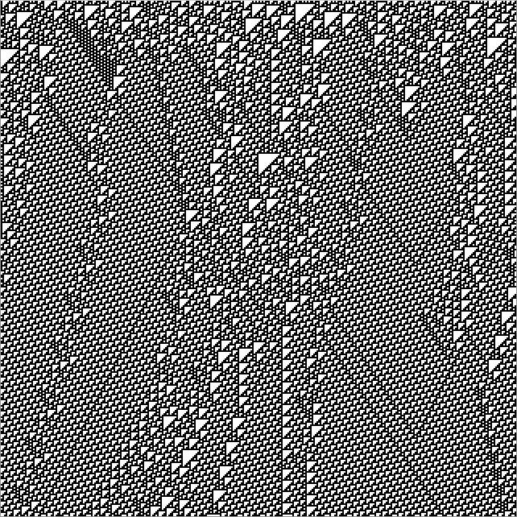

# automata
This program simulates different kinds of cellular automata. The code is (hopefully) modular and easy to modify.

Conway's Game of Life and all Elementary Cellular Automata are already implemented. Adding a new one is as easy as adding a function for it in `automata::rules`.

Here's Rule 110 starting from a random initial state:

### To Do:

* Implement more cool automata.
* Add boundary conditions other than periodic.
* Add a way to support user-defined palettes and rules without recompiling.
* Add hexagonal grids.
* Make it interactive.
